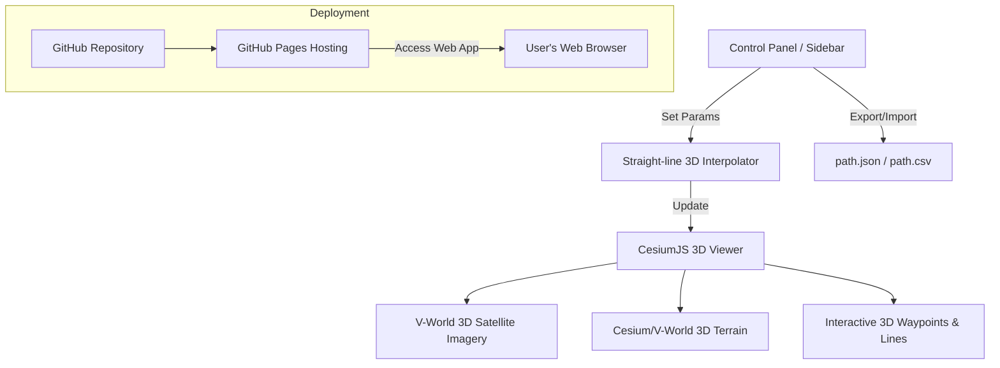

# Cesium 3D GPS Path Planner for Autonomous Patrol Vehicle

We are designing a premium, corporate-grade **3D digital twin path planner** using **CesiumJS** and **V-World** satellite maps. This tool allows users to map out 3D waypoint paths on a 3D terrain environment, automatically interpolate intermediate coordinates, assign actions, and export/import `path.json` files.

---

## 1. Design Aesthetics & Branding

### 💎 Visual Theme
*   **Corporate Light Glassmorphism**: A clean, bright interface optimized for high visibility. Crisp white and light gray background colors, with subtle semi-transparent panels and soft drop shadows (`backdrop-filter: blur(12px)`).
*   **No Childish Icons/Emoticons**: Absolutely no emojis, colorful cartoon elements, or informal styles. All buttons and status indicators will use clean, minimalist, high-contrast SVG vector icons.
*   **Typography**: Using Google Fonts **Inter** or **Outfit** for maximum technical readability, clean letter-spacing, and clear visual hierarchy.

### 🏢 Branding & Logo Integration
*   **Temporary Company Name**: `AEGIS AUTONOMY` (Guardian Systems).
*   **Logo Placeholder**: Configured in a dedicated header block. The UI will render a sleek SVG geometric icon alongside the text `AEGIS AUTONOMY` inside a wrapper class (`.brand-container`), which can be easily swapped for an `` tag with the company's real logo in the future.
    ```html
    <!-- Brand Container: Easy to swap with a real logo img -->
    <div class="brand-container">
        <!-- Replace the SVG below with  when ready -->
        <svg class="brand-logo-placeholder" ...></svg>
        <span class="brand-name">AEGIS AUTONOMY</span>
    </div>
    ```

---

## 2. Map & UI Architecture (Cesium 3D)



---

## 3. Key Deployment & Download Requirements

### 🚀 GitHub Pages Deployment
- Hosted **100% serverless** via **GitHub Pages**.
- Users can access the tool instantly from any device with a web browser using a URL like `https://username.github.io/repository-name/`.
- Clean repository structure:
  - `index.html`: Entry point.
  - `style.css`: Modern professional layout and styling.
  - `app.js`: Application logic (Cesium init, 3D waypoint math, export/import).

### 💾 Data Download (Client-Side Export)
- **JSON & CSV Download**: A button in the sidebar will generate the coordinate file dynamically in the browser.
- **Implementation**:
  ```javascript
  const blob = new Blob([JSON.stringify(pathData, null, 2)], { type: 'application/json' });
  const url = URL.createObjectURL(blob);
  const a = document.createElement('a');
  a.href = url;
  a.download = 'patrol_path.json';
  a.click();
  ```
- No database or backend is required for downloading, making it fast, secure, and compatible with any device.

---

## 4. 3D Waypoint Data Schema (`path.json`)

Each waypoint includes the height/elevation (`height`) in meters, which is crucial for 3D navigation and terrain-following:

```json
{
  "path_metadata": {
    "name": "Factory 3D Patrol Route",
    "map_engine": "Cesium 3D",
    "created_at": "2026-06-28T07:51:00Z",
    "interpolation_interval_meters": 1.0
  },
  "waypoints": [
    {
      "sequence": 1,
      "latitude": 37.123456,
      "longitude": 127.123456,
      "height": 45.2,
      "is_keypoint": true,
      "target_speed": 1.2,
      "action": {
        "type": "patrol_stop",
        "duration_seconds": 10.0,
        "payload": {
          "camera_angle": 90
        }
      }
    },
    {
      "sequence": 2,
      "latitude": 37.123465,
      "longitude": 127.123465,
      "height": 45.25,
      "is_keypoint": false,
      "target_speed": 1.2,
      "action": null
    }
  ]
}
```

---

## 5. 3D Straight-Line Interpolation Logic

For 3D space, we interpolate in Cartesian space (ECEF/WGS84) or local tangent plane (ENU) to preserve accurate 3D distance:

1. **Convert to Cartesian**: Click points $A(\text{lat}_1, \text{lon}_1, \text{height}_1)$ and $B(\text{lat}_2, \text{lon}_2, \text{height}_2)$ are converted to Cesium `Cartesian3` coordinates: $\mathbf{P}_A, \mathbf{P}_B \in \mathbb{R}^3$.
2. **Physical Distance**: Calculate the 3D straight-line distance:
   \[
   D = \|\mathbf{P}_B - \mathbf{P}_A\|_2
   \]
3. **Step Calculation**:
   \[
   N = \lfloor \frac{D}{d} \rfloor
   \]
   where $d$ is the interpolation interval (e.g., $1.0\text{ meter}$).
4. **Vector Interpolation**:
   \[
   \mathbf{P}_i = \mathbf{P}_A + \frac{i}{N} (\mathbf{P}_B - \mathbf{P}_A) \quad \text{for } i = 1, \dots, N-1
   \]
5. **Convert back to Geodetic**: Convert $\mathbf{P}_i$ back to (latitude, longitude, height) for output saving.

---

## 6. Future Roadmap: Phase 2 (Real-Time Firebase Integration)

While Phase 1 focuses on offline `path.json` generation and GitHub Pages deployment, Phase 2 will elevate the system to a live command center using **Google Firebase**:

*   **Real-time Photo & Video Upload (Cloud Storage)**: The autonomous vehicle can capture images or video feeds when detecting anomalies and instantly upload them to Firebase Cloud Storage, pushing alerts directly to the web UI.
*   **Live Vehicle Tracking (Realtime Database)**: The vehicle's Mini PC will push its live coordinates, allowing the Cesium 3D map to display a moving 3D model of the patrol vehicle in real-time.
*   **Over-the-Air Route Deployment (Firestore)**: Operators can edit and save routes on the web UI, which are instantly synced to the vehicle via Firestore, eliminating the need for manual file transfers.
*   **Security (Firebase Auth)**: Implement administrator logins to restrict access to the control room interface.
