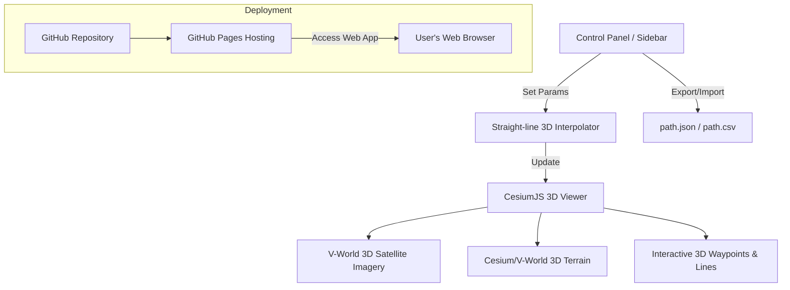

# 자율주행 방범 차량용 Cesium 3D GPS 경로 플래너 (한글본)

본 문서는 **CesiumJS** 및 **V-World** 3D 위성 지도를 활용한 기업용 고정밀 **3D 디지털 트윈 경로 플래너**의 기획 및 설계서입니다. 사용자는 3D 지형 환경에서 웨이포인트 경로를 마우스로 직접 지정할 수 있으며, 시스템은 지정된 지점 간의 3D 좌표를 자동 보간하고 이동 속도 및 특정 행동(Action)을 매핑하여 `path.json` 파일로 내보내거나 가져옵니다.

---

## 1. 디자인 미학 및 브랜드 통합 (Design Aesthetics & Branding)

### 💎 비주얼 테마
*   **기업형 라이트 글래스모피즘(Corporate Light Glassmorphism)**: 밝고 선명한 시야각을 제공하는 깔끔한 라이트 테마입니다. 깨끗한 화이트와 맑은 그레이 톤의 배경색에 부드러운 그림자와 반투명 효과(`backdrop-filter: blur(12px)`)를 더해 세련된 분위기를 연출합니다.
*   **유치한 요소 배제**: 불필요한 이모티콘이나 비전문적인 그래픽 요소는 일절 배제하며, 모든 아이콘과 상태 표시기는 미니멀한 단색 SVG 벡터 아이콘을 활용하여 고급스러운 가독성을 제공합니다.
*   **타이포그래피**: 텍스트 가독성을 극대화하기 위해 구글 폰트의 **Inter** 또는 **Outfit**을 적용하고 자간 및 폰트 두께 조절을 통해 정돈된 화면을 구성합니다.

### 🏢 브랜드 및 로고 통합
*   **가칭 회사명**: `AEGIS AUTONOMY` (이지스 오토노미)
*   **로고 플레이스홀더**: 화면 헤더 영역에 독립된 컨테이너(`.brand-container`)로 로고와 텍스트를 배치합니다. 추후 공식 회사 로고 이미지 파일이 준비되면 HTML 코드 상에서 간단하게 `` 태그로 교체할 수 있는 구조로 제공합니다.
    ```html
    <!-- Brand Container: 추후 실물 로고로 쉽게 교체 가능 -->
    <div class="brand-container">
        <!-- 로고 이미지 준비 시 아래 SVG를 로 교체 -->
        <svg class="brand-logo-placeholder" ...></svg>
        <span class="brand-name">AEGIS AUTONOMY</span>
    </div>
    ```

---

## 2. 3D 지도 및 시스템 구조 (Cesium 3D)



---

## 3. 배포 및 데이터 내보내기 요구사항

### 🚀 깃허브 페이지스(GitHub Pages) 배포
- 서버 사이드 연산 없이 클라이언트 단에서 구동되는 정적 웹 애플리케이션(HTML5, Vanilla CSS, Vanilla JS)으로 구성하여 **GitHub Pages**로 배포합니다.
- `https://<유저네임>.github.io/<저장소이름>/` 형식의 URL을 통해 누구나 접근하고 즉각 사용할 수 있습니다.
- 프로젝트 파일 구조:
  - `index.html`: 웹 도구의 기본 구조 및 엔트리 포인트
  - `style.css`: 고급스럽고 모던한 다크 테마 디자인 스타일시트
  - `app.js`: Cesium 3D 지도 초기화, 3D 보간 수학 연산, 파일 저장/가져오기 기능

### 💾 브라우저 기반 파일 다운로드 (Client-Side Export)
- **JSON 및 CSV 파일 생성**: 사이드바에 위치한 다운로드 버튼을 클릭하면 브라우저 자체적으로 다운로드 스트림을 생성하여 사용자 컴퓨터로 즉시 내려받도록 구현합니다.
- **예시 코드 구현 방식**:
  ```javascript
  const blob = new Blob([JSON.stringify(pathData, null, 2)], { type: 'application/json' });
  const url = URL.createObjectURL(blob);
  const a = document.createElement('a');
  a.href = url;
  a.download = 'patrol_path.json';
  a.click();
  ```
- 별도의 웹 서버나 데이터베이스와 연동하지 않으므로 보안성이 우수하며 응답 속도가 빠릅니다.

---

## 4. 3D 웨이포인트 데이터 형식 (`path.json`)

웨이포인트 각각의 고도/높이(`height`, 단위: 미터) 정보를 포함하여, 자율주행 차량이 지형 기복(오르막/내리막)이 있는 야외에서도 올바르게 내비게이션 할 수 있도록 보장합니다.

```json
{
  "path_metadata": {
    "name": "Factory 3D Patrol Route",
    "map_engine": "Cesium 3D",
    "created_at": "2026-06-28T07:51:00Z",
    "interpolation_interval_meters": 1.0
  },
  "waypoints": [
    {
      "sequence": 1,
      "latitude": 37.123456,
      "longitude": 127.123456,
      "height": 45.2,
      "is_keypoint": true,
      "target_speed": 1.2,
      "action": {
        "type": "patrol_stop",
        "duration_seconds": 10.0,
        "payload": {
          "camera_angle": 90
        }
      }
    },
    {
      "sequence": 2,
      "latitude": 37.123465,
      "longitude": 127.123465,
      "height": 45.25,
      "is_keypoint": false,
      "target_speed": 1.2,
      "action": null
    }
  ]
}
```

---

## 5. 3D 직선 보간 연산 (3D Straight-Line Interpolation)

지구의 곡률을 반영하여 두 지정 포인트 간의 공간적 왜곡을 없애기 위해, WGS84 데이텀에 입각한 3차원 Cartesian3 공간 내에서 선형 연산을 거칩니다.

1. **Cartesian3 좌표계 변환**: 클릭한 두 웨이포인트인 $A(\text{lat}_1, \text{lon}_1, \text{height}_1)$와 $B(\text{lat}_2, \text{lon}_2, \text{height}_2)$를 Cesium 3D 내부 좌표계인 Cartesian3 공간 좌표 벡터 $\mathbf{P}_A, \mathbf{P}_B \in \mathbb{R}^3$로 각각 매핑합니다.
2. **3D 공간 내 물리적 직선 거리 연산**:
   \[
   D = \|\mathbf{P}_B - \mathbf{P}_A\|_2
   \]
3. **분할 개수 산출**: 설정한 보간 간격 $d$ (예: $1.0\text{m}$)에 따른 총 단계 수 $N$을 계산합니다.
   \[
   N = \lfloor \frac{D}{d} \rfloor
   \]
4. **벡터 선형 보간**:
   \[
   \mathbf{P}_i = \mathbf{P}_A + \frac{i}{N} (\mathbf{P}_B - \mathbf{P}_A) \quad (\text{단, } i = 1, \dots, N-1)
   \]
5. **WGS84 변환**: 보간 계산이 끝난 $\mathbf{P}_i$ 벡터들을 다시 GPS 포맷인 위도, 경도, 고도 형태로 되돌려 JSON에 누적 저장합니다.

---

## 6. 향후 로드맵: Phase 2 (파이어베이스 실시간 관제 연동)

Phase 1(초기 버전)이 오프라인 기반의 `path.json` 파일 생성과 깃허브 배포에 집중한다면, Phase 2에서는 **Google Firebase**를 도입하여 시스템을 완벽한 실시간 관제 센터로 업그레이드할 예정입니다.

*   **현장 사진/영상 업로드 (Cloud Storage)**: 방범 차량이 순찰 중 이상 징후를 발견하면 현장 사진이나 영상을 찍어 파이어베이스 스토리지에 즉시 업로드하고, 웹 UI에 알림을 띄웁니다.
*   **실시간 차량 추적 (Realtime Database)**: 차량 내 미니 PC가 현재 위치(위경도)를 1초마다 전송하여, 웹의 Cesium 3D 지도 위에 차량의 3D 모델이 실시간으로 움직이는 모습을 구현합니다.
*   **무선 경로 배포 (Firestore)**: 웹에서 경로를 수정하고 저장하면 Firestore를 통해 차량으로 즉시 동기화되므로, USB를 이용한 번거로운 수동 파일 이동 과정을 완전히 없앱니다.
*   **관리자 보안 (Firebase Auth)**: 인가된 관리자만 접속하여 차량을 제어하고 경로를 수정할 수 있도록 강력한 로그인 보안 시스템을 구축합니다.
